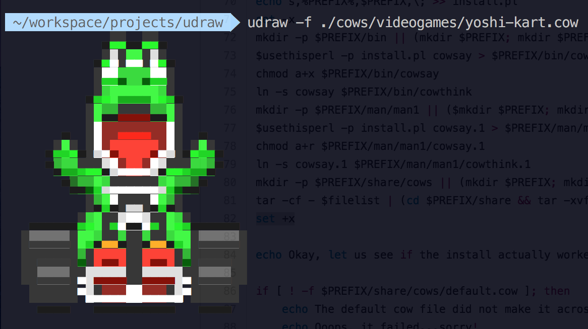

# udraw

Command line unicode drawing tool



## Dependencies

`udraw` requires `shuf`. To install:

```
brew install coreutils
ln -s /usr/local/bin/gshuf /usr/local/bin/shuf
```

## Installation

Clone or download repo and run `install.sh`. This will install `udraw` inside `/usr/local/bin` or otherwise specified.

To uninstall, remove file.

## Usage

By default, `udraw` looks for `default.cow` inside `$COWPATH`.

You can also specify the cow to draw with `-f`

e.g. `udraw -f ./cows/videogames/link.cow`

To display a random cow from a directory, I made a script that chooses a random file from the set `$COWPATH`. 
Code can be found inside the `bin` directory.

## Cows

This project was inspired by `cowsay`, using a simplified version of the code.

Inside the `cows` directory, there are a number of cows available to use. I grabbed the sprites from [The Spriters Resource](https://www.spriters-resource.com/)

To generate more `cows`, I used [img2xterm](https://github.com/rossy/img2xterm) to convert `png` images into unicode cows.
`img2xterm` requires `imagemagick` and `ncourses`. To install:

``` 
brew install imagemagick
brew install homebrew/dupes/ncurses
```

Also, remember the `--cow` flag. 

Then I wrote a script to remove the thought bubbles. Code can be found inside the `bin` directory.

Please submit PRs with new cows!
